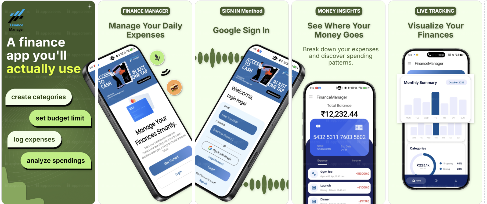

# 💰 Finance Manager App

🚀 A modern Android application to **track income, expenses, and manage finances smartly** with clean UI, analytics, and real-time insights.

---

## 📱 App Screens

📱 Screenshots
<p align="center">
  

</p>

### 🔐 Login & Onboarding

* Email & Password login
* Google Sign-In supported
* Clean onboarding with modern UI!


### 🏠 Dashboard

* Total Balance overview
* Income & Expense summary
* Weekly bar graph analytics
* Category-wise spending chart

### 💳 Transactions

* Add income or expense
* Categorize transactions
* View recent activity

---

## ✨ Features

* 📊 Animated charts (Bar + Donut)
* 💰 Real-time balance calculation
* 📉 Category-wise expense tracking
* 🌙 Dark mode support
* 🔐 Firebase Authentication (Google + Email)
* ⚡ Smooth UI & modern design

---

## 🚀 How to Use

### 🔑 Login / Signup

1. Open the app
2. Enter email & password OR click **"Sign in with Google"**
3. New user? Click **Sign Up**

---

### ➕ Add Income / Expense

1. Go to **Home / Transaction screen**
2. Tap the **➕ Floating Button**
3. Enter:

   * Amount
   * Category (e.g., Food, Shopping)
   * Note (optional)
4. Select:

   * **Income** or **Expense**
5. Click **Save**

---

### 📊 View Analytics

* Weekly bar chart shows spending trends
* Donut chart shows category distribution
* Balance updates automatically

---

## 🛠 Tech Stack

* **Language:** Java
* **Database:** Room DB
* **Auth:** Firebase Authentication
* **UI:** Material Design + Custom Views
* **Image Loading:** Glide

---

## 📂 Project Structure

```
com.sourav.financemanager
│── activities
│── fragments
│── database (Room)
│── adapters
│── models
│── utils
```

---

## ⚙️ Setup Instructions

1. Clone the repo:

```
git clone https://github.com/Fpvsourav955/FinanceManager.git
```

2. Open in **Android Studio**

3. Add Firebase:

* Connect project to Firebase
* Enable Authentication (Google + Email)

4. Run the app 🚀

---

## 🔥 Future Improvements

* ☁️ Cloud sync
* 📈 Advanced analytics
* 🔔 Smart reminders
* 👤 Profile editing

---
🔗 Download / Test App

👉 Play Store Internal Testing Link:
[Click here to install](https://play.google.com/apps/test/RQX4l824Lds/ahAO29uNRDlC35mJ5pyMs56DSv1LgiBCec1Zonp6XR_YODeBR9p0pSAQ6lgLnyKb9LxBB7qfo-ig4mQaZ63_T99wSq)
👉Drive Link APK
[Click here to download](https://drive.google.com/file/d/1HpK7sZZOSkOJ1BzPLigRLZyQyPzkyX_n/view?usp=drive_link)
📦 Install APK via Internal App Sharing

To quickly test the latest version of the app, use Google Play Internal App Sharing.

🚀 Steps to Install
1️⃣ Enable Internal App Sharing
Open Google Play Store
Tap your Profile icon (top right)
Go to Settings
Scroll down and open About
Tap “Play Store version” 7 times

You will see:

✅ Internal app sharing enabled

2️⃣ Turn ON Internal App Sharing
Go back to Settings
Tap General
Open Internal app sharing
Turn it ON

3️⃣ Install the App
Open the provided Internal App Sharing link
Tap Download
Install the app

## 👨‍💻 Developer

**Sourav Kumar Pati**
🚀 Android Developer | IoT Engineer

🔗 LinkedIn:
https://www.linkedin.com/in/sourav-kumar-pati-aa0833297

---

## ⭐ Support

If you like this project:

* ⭐ Star the repo
* 🍴 Fork it
* 🧠 Contribute

---
